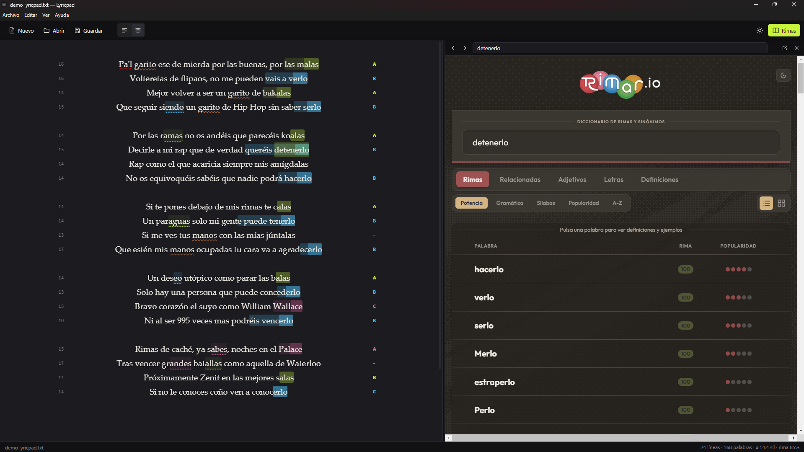

# Lyricpad

A minimal lyrics editor for Windows, with a rhyme dictionary docked right next to your text.

Write on the left, look up rhymes on the right. Select a word, right-click, **Look up rhymes**, done. No accounts, no cloud, no "AI co-writer". Just you and a blank page.



## Features

- **Plain text files**: New, Open, Save and Save As (`.txt`, `.md`, `.lrc`). Warns you before you lose unsaved changes. Drag a file onto the window to open it.
- **Light and dark theme.**
- **Left or centered text**, because some lyrics just look better centered.
- **Side-by-side rhymes panel** with [rimar.io](https://rimar.io) (Spanish) or [RhymeZone](https://www.rhymezone.com) (English). You can also plug in any other rhyme site with a custom search URL.
- **Right-click → Look up rhymes** on any word. If you select a whole line, it uses the last word, since that's the one that rhymes.
- **English and Spanish UI.**
- Line and word count, adjustable font size, and it remembers your theme, layout and window size.
- **Rhyme highlighting** as you type: perfect rhymes, assonance, multisyllabic rhymes, internal rhymes and whole lines that rhyme with each other. See [Rhymes and syllables](#rhymes-and-syllables).
- **Syllable count** for every line, in the margin, and a **stress pattern** under the text to check the flow.
- **Repeated word detector**, to catch the word you keep leaning on.
- **Focus mode**: full screen with nothing but your text.
- **Autosave and crash recovery**, so a power cut doesn't eat your verse.
- **Automatic updates** from GitHub Releases.

## Rhymes and syllables

Lyricpad reads your lyrics while you write and marks what rhymes, with no dictionary and nothing sent anywhere.

| You see | It means |
| --- | --- |
| Solid colour block | **Perfect rhyme**: everything matches from the stressed vowel on (*malas / bakalas*). |
| Faint block with a line under it | **Assonance**: only the vowels match (*casa / rabia*). |
| Faint block right before the rhyme | **Multisyllabic rhyme**: syllables before the stressed one match too. The longer the block, the more syllables rhyme. |
| Dotted underline | **Internal rhyme**: a word inside a line that shares the sound of a nearby line ending in the same stanza. |
| Dashed underline | The same word repeated, which isn't really a rhyme. |
| Wavy underline | **Repeated word**: used three or more times in the song, or twice almost in a row. Put the cursor on it to see every use and the count. A chorus sung twice counts once, and filler words are ignored. |
| Dots under the text | **Stress pattern**: one dot per spoken syllable, big where the stress falls. Two lines with the same syllable count can flow very differently, and this shows why. |
| Number in the left margin | **Syllables** in the line as you'd actually say them, merging vowels across words (*garito ese* → *ga-ri-toe-se*). |
| Letter in the right margin | **Rhyme scheme** of the stanza (A, B, A, B…). `–` means the line doesn't rhyme with anything near it. `≡` means the whole line rhymes with another one. |

Each sound gets its own colour and keeps it through the whole song. Put the cursor on a line and every rhyme that shares its sound lights up. The status bar shows the average syllables per line and how many lines rhyme.

Lines like `[Chorus]`, `(x2)` or `# note` are treated as labels and left out. Each of these can be switched on and off on its own in the **View** menu.

The analysis follows Spanish spelling and pronunciation rules. On lyrics in other languages the numbers and colours are only a rough guess.

**Tip:** press `Ctrl+R` on an empty line to look up rhymes for the last word of the line above.

## Download

Grab the latest version from [Releases](../../releases/latest). There are two flavours:

| File | What it is |
| --- | --- |
| `Lyricpad-x.y.z-win-x64.msi` | **Installer.** Adds Start menu and desktop shortcuts, no admin rights needed, and **updates itself**. |
| `Lyricpad-x.y.z-win-x64-portable.zip` | **Portable.** Unzip anywhere (even a USB stick) and run `Lyricpad.exe`. It tells you when there's a new version, but you replace the folder yourself. |

The app isn't code-signed, so Windows SmartScreen will probably complain the first time. Click **More info → Run anyway**.

### Updates

Every time it starts (and every few hours while it stays open), Lyricpad asks GitHub whether there's a newer release. If there is:

- **Installed version**: it downloads the new `.msi`, checks it against the checksum GitHub publishes, and installs it when you close Lyricpad (or right away, if you say so). Unsaved work still gets the usual "save changes?" prompt.
- **Portable version**: it opens the download page.

You can check manually with **Help → Check for updates…**, turn automatic checks off, or skip a specific version. The check is a single anonymous request to the public GitHub API. No accounts, no tracking.

## Keyboard shortcuts

| Action | Shortcut |
| --- | --- |
| New / Open / Save | `Ctrl+N` / `Ctrl+O` / `Ctrl+S` |
| Save As | `Ctrl+Shift+S` |
| Look up rhymes for selection | `Ctrl+R` |
| Toggle rhymes panel | `Ctrl+Shift+R` |
| Toggle syllable count | `Ctrl+Shift+Y` |
| Toggle rhyme highlighting | `Ctrl+Shift+H` |
| Toggle dark theme | `Ctrl+T` |
| Align left / center | `Ctrl+L` / `Ctrl+E` |
| Font size bigger / smaller / reset | `Ctrl+=` / `Ctrl+-` / `Ctrl+0` |
| Toggle stress pattern | `Ctrl+Shift+A` |
| Toggle repeated words | `Ctrl+Shift+D` |
| Focus mode (`Esc` to leave) | `F11` |

## Autosave and recovery

- Once a song has a file, Lyricpad saves it by itself a few seconds after you stop typing. Turn it off in **File → Autosave** if you'd rather save by hand.
- Unsaved text (including songs you haven't named yet) is also mirrored to a recovery file. If Lyricpad or your PC dies, it offers to bring it back the next time you open it.

## Custom rhyme service

In **View → Rhyme service → Custom…**, paste any search URL and put `{word}` where the word goes. For example:

```
https://www.rhymezone.com/r/rhyme.cgi?Word={word}&typeofrhyme=perfect
```

## Building from source

You need [Node.js](https://nodejs.org) 18 or newer.

```bash
npm install
npm start           # run in development
npm test            # tests for the syllable and rhyme engine
npm run build:dir   # unpacked Windows build in dist/win-unpacked
npm run build:win   # MSI installer (needs Windows, WiX is downloaded automatically)
```

### Releasing

Push a tag like `v1.2.0`. GitHub Actions builds the MSI and the portable ZIP on Windows and publishes them as a release. The app version comes from the tag, so there's no need to edit `package.json` by hand.

## Español

Lyricpad es un editor de letras minimalista para Windows con un diccionario de rimas al lado del texto. Seleccionas una palabra, clic derecho, **Consultar rimas**, y listo. La interfaz está en inglés y en español: el idioma se cambia en **Ver → Idioma**. Mientras escribes resalta las rimas (consonantes, asonantes, multisilábicas, internas y versos enteros), cuenta las sílabas de cada verso y guarda solo. Hay versión instalable (`.msi`, se actualiza sola) y portable (`.zip`).

## License

[MIT](LICENSE). Lyricpad only embeds the rhyme websites; their content belongs to their respective owners.
